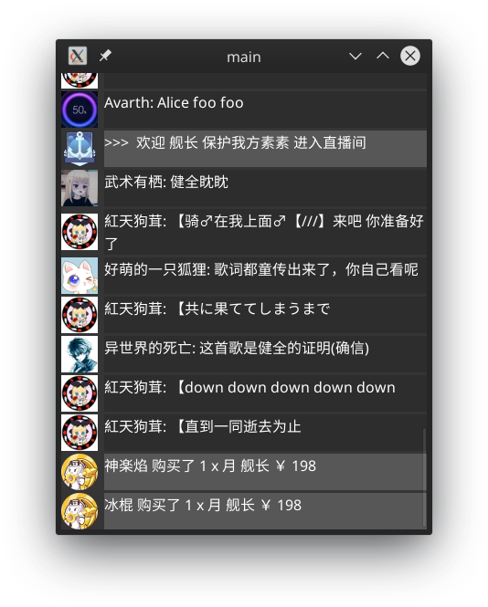
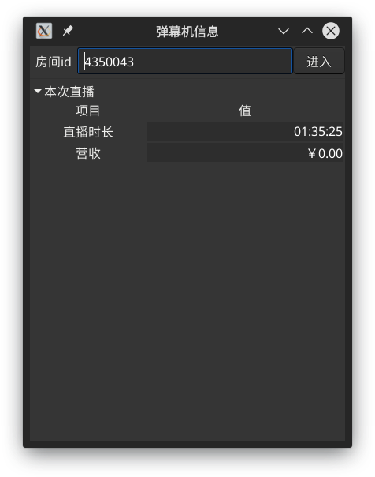

## bilibili 直播弹幕机
golang go version go1.15.4 linux/amd64

## LICENSE
使用了下述的项目，十分感谢
- [golang](https://golang.org/) under [BSD](https://golang.org/LICENSE)
- [github.com/gotk3/gotk3](https://github.com/gotk3/gotk3) under [ISC](https://raw.githubusercontent.com/gotk3/gotk3/master/LICENSE)
- [github.com/qydysky/part](https://github.com/qydysky/part) under [MIT](https://raw.githubusercontent.com/qydysky/part/master/LICENSE)
- [github.com/christopher-dG/go-obs-websocket](https://github.com/christopher-dG/go-obs-websocket) under [MIT](https://raw.githubusercontent.com/christopher-dG/go-obs-websocket/master/LICENSE)
- [github.com/gorilla/websocket](https://github.com/gorilla/websocket) under [BSD 2-Clause](https://raw.githubusercontent.com/gorilla/websocket/master/LICENSE)

### 当前支持显示/功能
以下内容可能过时，点击查看[当前支持显示](https://github.com/qydysky/bili_danmu/blob/master/Reply/Msg.go#L13)
```
显示
case 后有函数调用的为支持，为nil的为待完善，注释掉的调用为未启用

//Msg类型数据处理方法map
var Msg_map = map[string]func(replyF, string) {
	"PK_BATTLE_PRE":nil,//人气pk
	"PK_BATTLE_START":nil,//人气pk
	"PK_BATTLE_PROCESS":nil,//人气pk
	"PK_BATTLE_END":nil,//人气pk
	"PK_BATTLE_RANK_CHANGE":nil,//人气pk
	"PK_BATTLE_SETTLE_USER":nil,//人气pk
	"PK_BATTLE_SETTLE_V2":nil,//人气pk
	"PK_BATTLE_SETTLE":nil,//人气pk
	"SYS_MSG":nil,//系统消息
	"ROOM_SKIN_MSG":nil,
	"GUARD_ACHIEVEMENT_ROOM":nil,
	"ANCHOR_LOT_START":nil,//天选之人开始
	"ANCHOR_LOT_CHECKSTATUS":nil,
	"ANCHOR_LOT_END":nil,//天选之人结束
	"ANCHOR_LOT_AWARD":nil,//天选之人获奖
	"COMBO_SEND":nil,
	"INTERACT_WORD":nil,
	"ACTIVITY_BANNER_UPDATE_V2":nil,
	"NOTICE_MSG":nil,
	"ROOM_BANNER":nil,
	"ONLINERANK":nil,
	"WELCOME":nil,
	"HOUR_RANK_AWARDS":nil,
	"ROOM_RANK":nil,
	"ROOM_SHIELD":nil,
	"USER_TOAST_MSG":replyF.user_toast_msg,//大航海购买信息
	"WIN_ACTIVITY":replyF.win_activity,//活动
	"SPECIAL_GIFT":replyF.special_gift,//节奏风暴
	"GUARD_BUY":nil,//replyF.guard_buy,//大航海购买
	"WELCOME_GUARD":replyF.welcome_guard,//大航海进入
	"DANMU_MSG":replyF.danmu,//弹幕
	"ROOM_CHANGE":replyF.room_change,//房间信息分区改变
	"ROOM_SILENT_OFF":replyF.roomsilent,//禁言结束
	"ROOM_SILENT_ON":replyF.roomsilent,//禁言开始
	"SEND_GIFT":replyF.send_gift,//礼物
	"ROOM_BLOCK_MSG":replyF.room_block_msg,//封禁
	"PREPARING":replyF.preparing,//下播
	"LIVE":replyF.live,//开播
	"SUPER_CHAT_MESSAGE":nil,//replyF.super_chat_message,//SC
	"SUPER_CHAT_MESSAGE_JPN":replyF.super_chat_message,//SC
	"PANEL":replyF.panel,//排行榜
	"ENTRY_EFFECT":nil,//replyF.entry_effect,//进入特效
	"ROOM_REAL_TIME_MESSAGE_UPDATE":nil,//replyF.roominfo,//粉丝数
}
```
以下内容可能过时，点击查看[当前支持功能](https://github.com/qydysky/bili_danmu/blob/master/Reply/F.go#L16)
```
其他功能
自动化功能、挑选有价值的弹幕，可在demo/config_F.json覆盖默认控制
//功能开关
var AllF = map[string]bool{
	"Saveflv":true,//保存直播流(仅高清)
	/*
		Saveflv需要外部组件
		ffmpeg http://ffmpeg.org/download.html
	*/
	"Obs":false,//obs组件(仅录播)
	/*
		Obs需要外部组件:
		obs https://obsproject.com/download
		obs-websocket https://github.com/Palakis/obs-websocket/releases
	*/
	"Ass":true,//Ass弹幕生成，由于时间对应关系,仅开启流保存时生效
	"Autoban":true,//自动封禁(仅提示，未完成)
	"Jiezou":true,//带节奏预警，提示弹幕礼仪
	"Danmuji":true,//反射型弹幕机，回应弹幕
	"Danmuji_auto":false,//自动型弹幕机，定时输出
	"Autoskip":true,//刷屏缩减，相同合并
	"Lessdanmu":true,//弹幕缩减，屏蔽与前n条弹幕重复的字数占比度高于阈值的弹幕
	"Moredanmu":false,//弹幕增量
	"Shortdanmu":true,//上下文相同文字缩减
}
```
以下内容可能过时,其他小功能
```
弹幕重连
直播流开播自动下载
直播流下载重连
gtk弹幕窗自定义人/事件消息停留/房间切换/弹幕格式化发送
营收统计
...
```
### 构建
本项目使用github action自动构建，构建过程详见[yml](https://github.com/qydysky/bili_danmu/blob/master/.github/workflows/go.yml)

### demo 
前往[releases](https://github.com/qydysky/bili_danmu/releases)页下载对应系统版本。解压后进入`demo`目录(文件夹)，运行`demo.run`(`demo.exe`)。
```
./demo.run -q 清晰度 -r 房间ID
```

> 清晰度可取[数值](https://github.com/qydysky/bili_danmu/blob/028d6d8ed47df4631aca7df93871a4795bedda76/CV/Var.go#L19)
> 弹幕及礼物会记录于danmu.log中

**部分功能需要在`demo`目录(文件夹)下放置`cookie.txt`才可用**

### 效果展示
以下内容可能过时，以实际运行为准
- 命令窗口(以下为截取)
```
$ go run main.go 
输入房间号: 213
INFO: 2020/09/16 16:48:11 [bili_danmu.go 测试] [连接到房间 213]
INFO: 2020/09/16 16:48:11 [bili_danmu.go 测试] [连接 wss://tx-sh-live-comet-01.chat.bilibili.com/sub]
INFO: 2020/09/16 16:48:11 [bili_danmu.go 测试] [已连接到房间 213]
INFO: 2020/09/16 16:48:11 [bili_danmu.go 测试] [开始心跳]
```
```
//大航海进入
>>> 欢迎 舰长 茶摊儿在森林喝碗山海 进入直播间
```
```
//普通弹幕
老鸡捉小鹰
你快扒拉他
你这好像是补刀
吓人
```
```
//礼物
====
孤单猫与淋雨猪 投喂 1314 x 辣条 ( 131400 x 金瓜子 )
====
```
```
//同字符串合并
7 x 原神公测B服冲冲冲
```
```
//同字符忽略
原神公测B站冲冲冲
...B服冲冲冲
```
```
//SC
====
SC:  吹舞火 ￥ 30
我旁边的一万是幻觉吗？
私の隣の一万は幻ですか？
====
```
```
//gtk的弹幕格式化发送
2020/11/20 15:39:57 弹幕格式已设置为 [{D}]
INFO: 2020/11/20 15:40:05 [弹幕发送] [发送 [就是这样] 至 394988]
[就是这样]
INFO: 2020/11/20 15:40:15 [弹幕发送] [发送 [你知道么] 至 394988]
[你知道么]
2020/11/20 15:42:38 弹幕长度大于20,不做格式处理
INFO: 2020/11/20 15:42:38 [弹幕发送] [发送 11111111111111111111 至 394988]
11111111111111111111
```
ctrl+c退出，会同时追加记录到文件danmu.log中（文件记录完整信息,不会减少附加功能作用的弹幕）
- 流保存以及弹幕ass
```
结束后会保存为
房间号_时间.mkv
房间号_时间.ass
```
结束后的文件播放效果(显于左上)

[截图地址](//zdir.ntsdtt.bid/ALL/Admin/Remote/%E5%9B%BE%E7%89%87/Screenshot_20200926_173834.png)

- Gtk弹幕窗(Linux Only)



[截图地址](//zdir.ntsdtt.bid/ALL/Admin/Remote/%E5%9B%BE%E7%89%87/Screenshot_20201023_232029.png)



[截图地址](//zdir.ntsdtt.bid/ALL/Admin/Remote/%E5%9B%BE%E7%89%87/Screenshot_20201119_124329.png)

更多内容详见注释，如有疑问请发issues，欢迎pr
